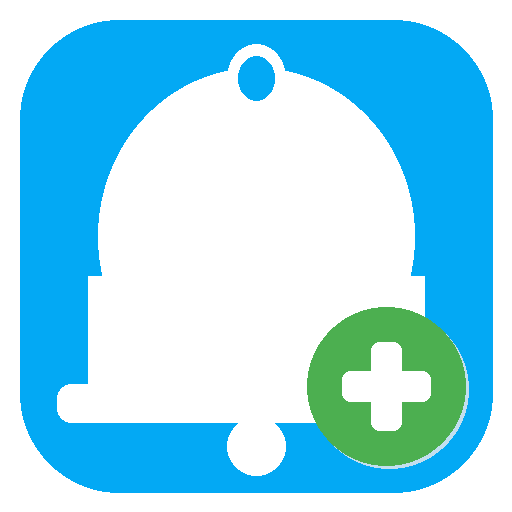

# Notify HA Plus

<p align="center">
  
</p>

<p align="center">

[![HACS Custom][hacs-badge]][hacs-url]
[![GitHub Release][release-badge]][release-url]
[![License][license-badge]][license-url]
[![Hassfest][hassfest-badge]][hassfest-url]
[![HACS Validation][hacs-val-badge]][hacs-val-url]
[![CodeQL][codeql-badge]][codeql-url]
[![Downloads][downloads-badge]][downloads-url]

</p>

---

**🇩🇪 [Deutsch](#deutsch)** | **🇬🇧 [English](#english)**

---

## Deutsch

Gruppenfahiger Benachrichtigungsdienst fur Home Assistant. Stellt eine vollwertige Integration mit einem Service bereit, der aus jeder Automation und jeder anderen Integration (z.B. [Smart Garage](https://github.com/thokoh74-DE/smart-garage)) aufgerufen werden kann.

### Funktionen

| Feature | Beschreibung |
|---------|-------------|
| **Personen & Gerate** | Uber die HA-Oberflache hinzufugen, bearbeiten und entfernen. Anderungen sofort wirksam. |
| **Gruppen** | Frei definierbar (z.B. `admin`, `family`, `alexa`). Jede Person/jedes Gerat kann beliebig vielen Gruppen angehoren. |
| **Anwesenheits-Ziele** | `home`, `away`, `home_or_last_away` - automatisch basierend auf dem Status der Person-Entitat. |
| **Device Tracker** | Optionaler zusatzlicher `device_tracker` pro Person (z.B. FRITZ!Box, Nmap) fur erweiterte Anwesenheitserkennung. |
| **Ziel-Auswahl per Klick** | Alle Personen, Gruppen und Anwesenheits-Ziele als auswaehlbare Entitaten im Automatisierungs-Editor. |
| **Profilbilder & Icons** | Personen zeigen ihr HA-Profilbild. Gruppen, Gerate und Anwesenheits-Ziele haben eigene Icons. |
| **Alexa Volume Ducking** | Automatisches Anheben/Absenken der Lautstarke betroffener Alexa-Media-Player wahrend der Ansage. |
| **Kritische Benachrichtigungen** | Unterbrechend mit erhohter Lautstarke (iOS Critical Alerts, Alexa). |
| **Kein Sound** | Lautlose Benachrichtigungen mit Bildschirmanzeige. iOS: `presentation_options`. Android: konfigurierbarer Kanal. |
| **Medien & Links** | Bild, Video, Live-Stream-URL und Dashboard-Link als Aktions-Buttons. |
| **Persistenter Status** | Zeitstempel, auslosende Automation und Nachrichtenvorschau uberleben HA-Neustarts. |
| **3 Diagnose-Sensoren** | Anwesende Personen, Abwesende Personen, Zuletzt abwesend (Echtzeit). |
| **Gefuhrte Ersteinrichtung** | Config-Flow leitet direkt in die Personen-/Gruppen-Konfiguration. |
| **Zweisprachig** | Vollstandig auf Deutsch und Englisch. |

### Installation

#### HACS (empfohlen)

[](https://my.home-assistant.io/redirect/hacs_repository/?owner=thokoh74-DE&repository=notifiy_ha_plus&category=integration)

Oder manuell: **HACS** -> **Integrationen** -> **Drei-Punkte-Menu** -> **Benutzerdefinierte Repositories** -> `https://github.com/thokoh74-DE/notifiy_ha_plus` als Integration hinzufugen.

#### Manuell

1. Ordner `custom_components/notify_ha_plus` nach `<config>/custom_components/` kopieren
2. Home Assistant neu starten

#### Integration hinzufugen

[](https://my.home-assistant.io/redirect/config_flow_start/?domain=notify_ha_plus)

Oder manuell: **Einstellungen** -> **Gerate & Dienste** -> **Integration hinzufugen** -> **"Notify HA Plus"**

### Einrichtung

Nach der Installation leitet der Assistent direkt durch die Ersteinrichtung:

1. **Personen hinzufugen** - Person-Entitat, Notify-Dienst (z.B. `mobile_app_samsung_a53_thomas`), Gruppen, optionaler Device Tracker
2. **Gerate hinzufugen** - z.B. Alexa-Lautsprecher mit `alexa_media_*` Notify-Dienst
3. **Lautstarke & Kanal** - Alexa-Lautstarke fur normale/kritische Ansagen, Android-Kanalname fur lautlose Benachrichtigungen
4. **Einrichtung abschliessen** - Integration wird geladen, Entitaten erscheinen sofort

Spatere Anderungen: **Einstellungen** -> **Gerate & Dienste** -> **Notify HA Plus** -> **Konfigurieren**

### Verwendung

#### In Automationen (visueller Editor)

**Aktion hinzufugen** -> **"Notify HA Plus: Benachrichtigung senden"** -> Ziel aus der Liste wahlen -> Nachricht eingeben -> fertig.

#### Im YAML

```yaml
action: notify_ha_plus.send_notification
data:
  target:
    - notify.system_notify_ha_plus_gruppe_family
  title: Haustuer
  message: Es hat geklingelt.
  image_path: /media/local/haustuer.jpg
  dashboard_url: http://192.168.5.144:8123/kamera-haustur/0
  critical: true
```

#### Aus einer eigenen Integration (Python)

```python
await hass.services.async_call(
    "notify_ha_plus",
    "send_notification",
    {
        "target": ["notify.system_notify_ha_plus_gruppe_family"],
        "title": "Garage",
        "message": "Garagentor ist seit 10 Minuten offen.",
        "critical": True,
    },
)
```

### Service-Felder

| Feld | Pflicht | Beschreibung |
|------|---------|-------------|
| `target` | Ja | Eine oder mehrere Notify HA Plus Ziel-Entitaten |
| `message` | Ja | Der Benachrichtigungstext |
| `title` | Nein | Optionaler Titel |
| `image_path` | Nein | Pfad zu einem JPEG/PNG-Bild |
| `video_path` | Nein | Pfad zu einem MP4-Video |
| `live_stream_url` | Nein | RTSP/MJPEG-Link als Aktions-Button |
| `dashboard_url` | Nein | Dashboard-Link als Aktions-Button |
| `tag` | Nein | Kennung (per `clear_notification`) |
| `ttl` | Nein | Ablaufzeit in Sekunden (0-3600) |
| `priority` | Nein | `high`, `normal` oder `low` |
| `critical` | Nein | Kritische/unterbrechende Benachrichtigung |
| `silent` | Nein | Kein Sound, nur Bildschirmanzeige |

---

## English

Group-aware notification dispatcher for Home Assistant. Provides a proper integration exposing a service that can be called from any automation or other integration (e.g. [Smart Garage](https://github.com/thokoh74-DE/smart-garage)).

### Features

| Feature | Description |
|---------|------------|
| **Persons & devices** | Add, edit, and remove through the HA UI. Changes take effect immediately. |
| **Groups** | Freely definable (e.g. `admin`, `family`, `alexa`). Each person/device can belong to any number of groups. |
| **Presence targets** | `home`, `away`, `home_or_last_away` - automatically based on the person entity's state. |
| **Device tracker** | Optional additional `device_tracker` per person (e.g. FRITZ!Box, Nmap) for enhanced presence detection. |
| **Pick targets from a list** | All persons, groups, and presence targets appear as selectable entities in the Automation editor. |
| **Profile pictures & icons** | Persons show their HA profile picture. Groups, devices, and presence targets have distinct icons. |
| **Alexa volume ducking** | Automatically raises/lowers volume of affected Alexa media players during announcements. |
| **Critical notifications** | Interruptive with raised volume (iOS Critical Alerts, Alexa). |
| **Silent mode** | Notifications that appear on screen without sound. iOS: `presentation_options`. Android: configurable channel. |
| **Media & links** | Image, video, live stream URL, and dashboard link as action buttons. |
| **Persistent status** | Timestamp, triggering automation, and message preview survive HA restarts. |
| **3 diagnostic sensors** | Persons at home, persons away, last person to leave (real-time). |
| **Guided initial setup** | Config flow walks you through person/group setup right after installation. |
| **Bilingual** | Fully translated into German and English. |

### Installation

#### HACS (recommended)

[](https://my.home-assistant.io/redirect/hacs_repository/?owner=thokoh74-DE&repository=notifiy_ha_plus&category=integration)

Or manually: **HACS** -> **Integrations** -> **Three-dot menu** -> **Custom repositories** -> add `https://github.com/thokoh74-DE/notifiy_ha_plus` as Integration.

#### Manual

1. Copy `custom_components/notify_ha_plus` to `<config>/custom_components/`
2. Restart Home Assistant

#### Add integration

[](https://my.home-assistant.io/redirect/config_flow_start/?domain=notify_ha_plus)

Or manually: **Settings** -> **Devices & Services** -> **Add Integration** -> **"Notify HA Plus"**

### Setup

After installation, the wizard walks you through the initial setup:

1. **Add persons** - Person entity, notify service (e.g. `mobile_app_iphone`), groups, optional device tracker
2. **Add devices** - e.g. Alexa speakers with `alexa_media_*` notify service
3. **Volume & channel** - Alexa volume for normal/critical announcements, Android channel name for silent notifications
4. **Finish setup** - Integration loads, entities appear immediately

Later changes: **Settings** -> **Devices & Services** -> **Notify HA Plus** -> **Configure**

### Usage

#### In automations (visual editor)

**Add action** -> **"Notify HA Plus: Send notification"** -> pick target from list -> enter message -> done.

#### YAML

```yaml
action: notify_ha_plus.send_notification
data:
  target:
    - notify.system_notify_ha_plus_gruppe_family
  title: Front door
  message: Someone rang the bell.
  critical: true
```

#### From a custom integration (Python)

```python
await hass.services.async_call(
    "notify_ha_plus",
    "send_notification",
    {
        "target": ["notify.system_notify_ha_plus_gruppe_family"],
        "title": "Garage",
        "message": "Garage door has been open for 10 minutes.",
        "critical": True,
    },
)
```

### Service fields

| Field | Required | Description |
|-------|----------|------------|
| `target` | Yes | One or more Notify HA Plus target entities |
| `message` | Yes | The notification text |
| `title` | No | Optional title |
| `image_path` | No | Path to a JPEG/PNG image |
| `video_path` | No | Path to an MP4 video |
| `live_stream_url` | No | RTSP/MJPEG link as action button |
| `dashboard_url` | No | Dashboard link as action button |
| `tag` | No | Identifier (for `clear_notification`) |
| `ttl` | No | Time to live in seconds (0-3600) |
| `priority` | No | `high`, `normal`, or `low` |
| `critical` | No | Critical/interruptive notification |
| `silent` | No | No sound, screen display only |

---

## Links

- **GitHub**: [thokoh74-DE/notifiy_ha_plus](https://github.com/thokoh74-DE/notifiy_ha_plus)
- **Issues**: [Bug Reports & Feature Requests](https://github.com/thokoh74-DE/notifiy_ha_plus/issues)
- **Changelog**: [CHANGELOG.md](CHANGELOG.md)

---

<!-- Badge references -->
[hacs-badge]: https://img.shields.io/badge/HACS-Custom-41BDF5.svg?style=for-the-badge
[hacs-url]: https://github.com/hacs/integration
[release-badge]: https://img.shields.io/github/v/release/thokoh74-DE/notifiy_ha_plus?style=for-the-badge
[release-url]: https://github.com/thokoh74-DE/notifiy_ha_plus/releases/latest
[license-badge]: https://img.shields.io/github/license/thokoh74-DE/notifiy_ha_plus?style=for-the-badge
[license-url]: https://github.com/thokoh74-DE/notifiy_ha_plus/blob/main/LICENSE
[hassfest-badge]: https://img.shields.io/github/actions/workflow/status/thokoh74-DE/notifiy_ha_plus/hassfest.yml?label=Hassfest&style=for-the-badge
[hassfest-url]: https://github.com/thokoh74-DE/notifiy_ha_plus/actions/workflows/hassfest.yml
[hacs-val-badge]: https://img.shields.io/github/actions/workflow/status/thokoh74-DE/notifiy_ha_plus/hacs.yml?label=HACS&style=for-the-badge
[hacs-val-url]: https://github.com/thokoh74-DE/notifiy_ha_plus/actions/workflows/hacs.yml
[codeql-badge]: https://img.shields.io/github/actions/workflow/status/thokoh74-DE/notifiy_ha_plus/codeql.yml?label=CodeQL&style=for-the-badge
[codeql-url]: https://github.com/thokoh74-DE/notifiy_ha_plus/actions/workflows/codeql.yml
[downloads-badge]: https://img.shields.io/github/downloads/thokoh74-DE/notifiy_ha_plus/total?style=for-the-badge
[downloads-url]: https://github.com/thokoh74-DE/notifiy_ha_plus/releases
